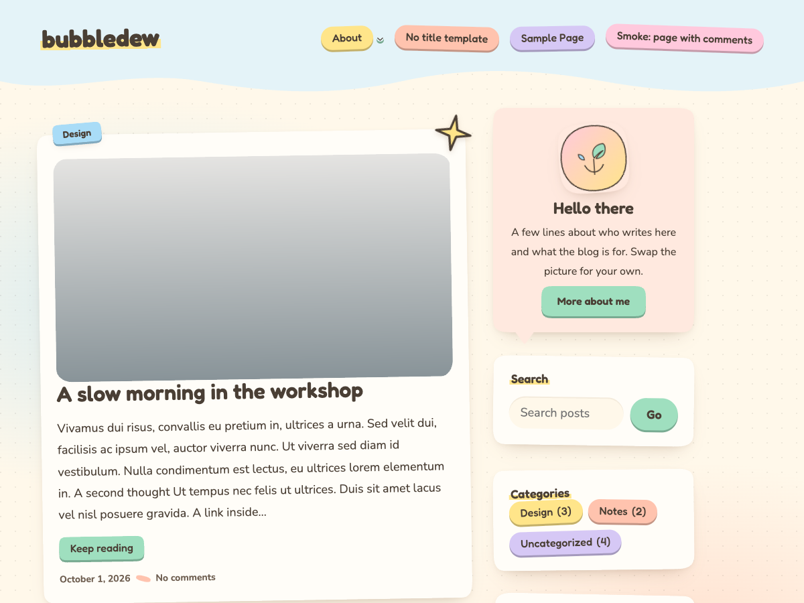

# Bubbledew

A whimsical pastel blog theme for the WordPress Site Editor. The posts list sits in a narrow 640px column on the left with a 300px sidebar on the right inside a 1080px shell; every post is a tilted pastel card with its category on a name tag across the top edge. Single posts and pages are one reading column, comments are speech bubbles, and headings are set in Fredoka with Nunito for body text, both bundled with the theme.

Everything is core blocks and `theme.json`. Templates and parts under `templates/` and `parts/` are thin shells; the block markup lives in PHP patterns under `patterns/` so strings can be translated. Three block styles ship as JSON partials under `styles/blocks/`: Speech bubble, Sticky note and Highlight. See `CLAUDE.md` for the architecture notes and `readme.txt` for the directory readme.



## Requirements

- WordPress 6.6+
- PHP 7.4+
- Node.js 24
- Composer

## Getting started

```bash
npm install
composer install
npm run build
```

Then copy or symlink this folder into `wp-content/themes/bubbledew` and activate **Bubbledew**. `npm run wp-env:start` boots a local site (Docker) with the theme already active, and `npm run seed` fills it with test content.

## Development

| Command                                                    | Purpose                                                          |
| ---------------------------------------------------------- | ---------------------------------------------------------------- |
| `npm run start`                                            | Build `src/` into `dist/` and watch for changes                  |
| `npm run build`                                            | Production build                                                 |
| `npm run lint:js`, `npm run lint:scss`, `npm run lint:php` | ESLint, Stylelint, PHP_CodeSniffer                               |
| `composer analyse`                                         | PHPStan                                                          |
| `npm run validate:blocks`                                  | Parse patterns, templates and parts with the core block registry |
| `npm run test:smoke`, `npm run check:a11y`                 | Templates at desktop and phone widths; axe-core WCAG 2.1 A/AA    |
| `npm run review:check`                                     | Theme Check on a `.distignore`-staged copy                       |
| `npm run format`                                           | Prettier                                                         |

## Releasing

Bump `Version` in `style.css` and `version` in `package.json` to the same value, then push a tag such as `v1.0.0`. `.github/workflows/release.yml` builds the theme, stages it through `.distignore`, and publishes `bubbledew.zip` on a GitHub release.

Once a release exists, the theme can be tried in WordPress Playground without installing anything. `.github/blueprint.json` installs the latest release zip and activates it:

[Open Bubbledew in Playground](https://playground.wordpress.net/?blueprint-url=https://raw.githubusercontent.com/philhoyt/bubbledew/main/.github/blueprint.json)

## License

GNU General Public License v2 or later.
